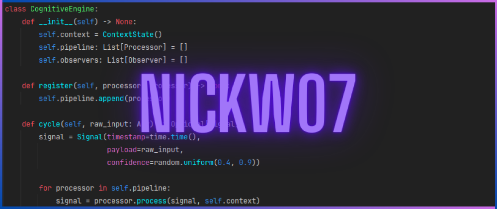

# 👋 | Hi there

---

## 👤 | About me

- 🚀 17 y.
- 🌱 Passionate about improving my technical expertise through hands-on coding
- 💻 I share projects here that I build while exploring new concepts and tools
- 🐍 I'm primarily using Python
- 🛠️ Currently, I'm working on `Password Manager (Tkinter)` &  `Aim Trainer (Pygame)`
- 🌐 Discord: @nick.07
- ⌨️ Typing stats: https://monkeytype.com/profile/n1ck07

---

## 🛠️ | Working with ...

---

## 📁 | Latest Projects
- 👾 ['Fall Down' (Python & Pygame)](https://github.com/nickw07/falldown-pygame.git) - My first ever game, developed in one week using Python and Pygame
- 💻 [Windows Desktop Tool (Python & Tkinter)](https://github.com/nickw07/windows-desktoptool-tkinter.git) - OS managment tool made with Python and Tkinter
- 🕹️ [Console Games Collection](https://github.com/nickw07/console-games-python.git) - A Python console application featuring three classic games
- 📖 [Game Review (HTML & CSS)](https://github.com/nickw07/game-review-html-css.git) - A simple website featuring a game review
